# Programacion Movil-Asignación 4

La aplicación a desarrollar consistirá en un visualizador de actividades de la app del gymnasio ulima. El usuario se registrará e ingresará en el login y vera un dashbard de notificaciones y pantallas para su simulación de entrenamiento y su referencia de ejercicios por día, asi como tambien una pestaña de usuario donde tendrá sus actividades y logros.Además, este involucrara el SDK de Flutter un codigo abierto creado por google para aplicativos movil android y IOS.

## Instalación 🔧

Para la instalación de FLUTTER, primero se debe de descargar desde el link oficial de Flutter usando este link [Instalar Flutter SDK](https://docs.flutter.dev/get-started/install/windows)

### Instalar Flutter 
---

**Paso 1: Descargar el archivo _".zip"_ de la version más estable**

Seleccionar la opcion correspondiente al sistema operativo a ejecutar.
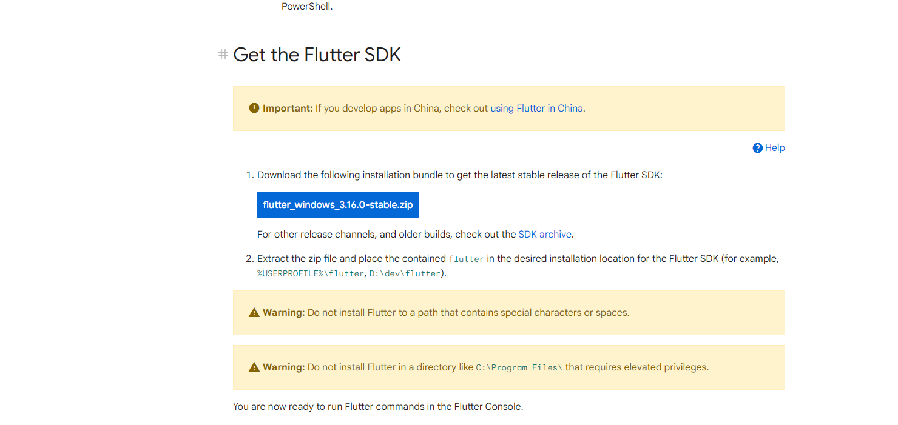

**Paso 2: Descomprimir el archivo _".zip"_ en la la dirección C de disco duro dentro de la carpeta src que crearemos**

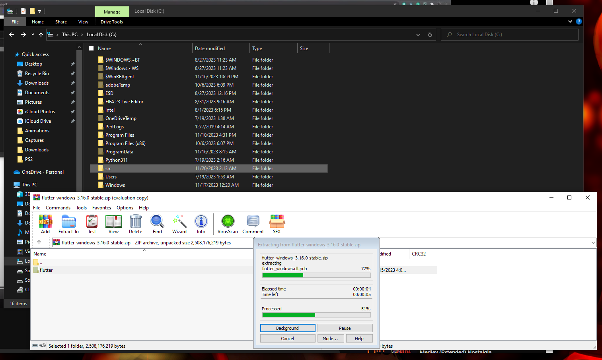

**Paso 3: Pulsamos el boton windows y escribimos "editar variables del entorno" o en ingles "edit the system environment varibles" y creamos una nueva variable con el url de la carpeta donde descomprimimos y le añadiremos el slash bin como este ejemplo "C:\src\flutter\bin"**
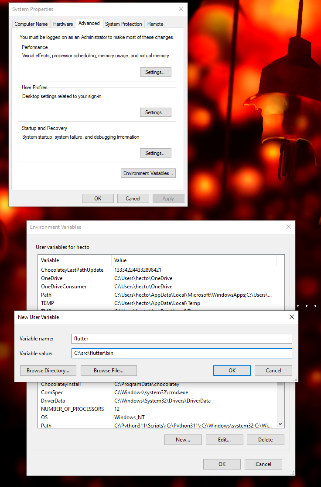

**Paso 4: Nos dirigimos a la carpeta donde descomprimimos flutter y ejecutamos "flutter_console.bat" y dentro de la consola ejecutamos el comando "flutter doctor"**
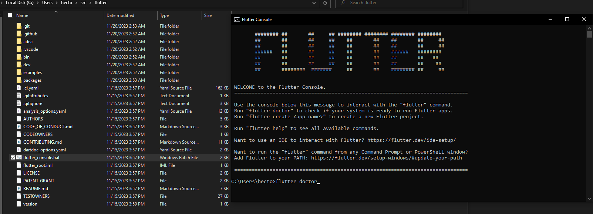

**Paso 5: En este caso no sale ninguna dependecia a instalar, pero en la gran mayoria de casos sale el mensaje de "Doctor found issues in 3 categories" el numero de errores puede variar, para solucionar este error se usa el comando "flutter doctor --android-licenses" y se instalaran las dependencias necesarias para aceptar los contractos solo pulsar el boton "y" y finalmente quedaria la pantalla de "no issues found!"**

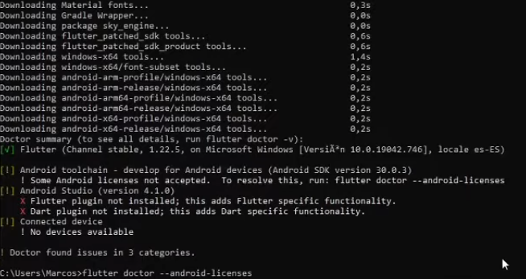
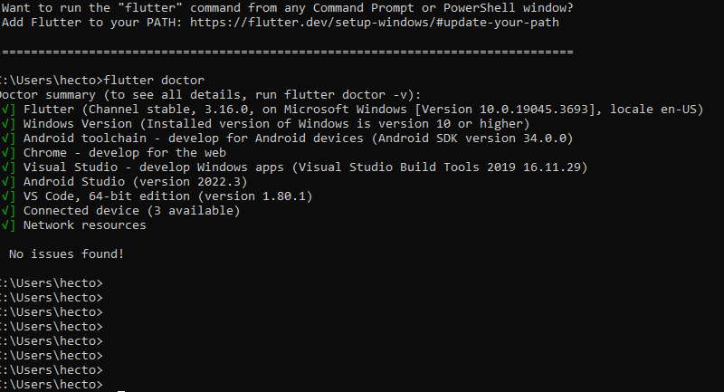

**Paso 6: Abrimos vs code e instalamos flutter y dart dentro de la app en el apartado de extensions**

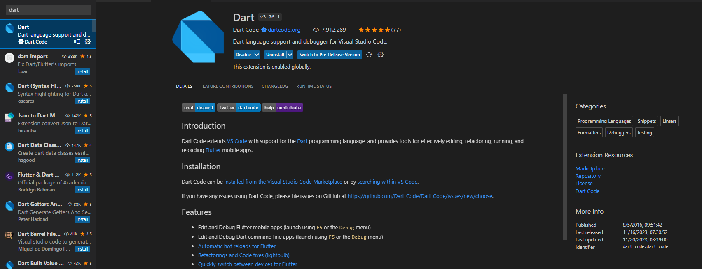
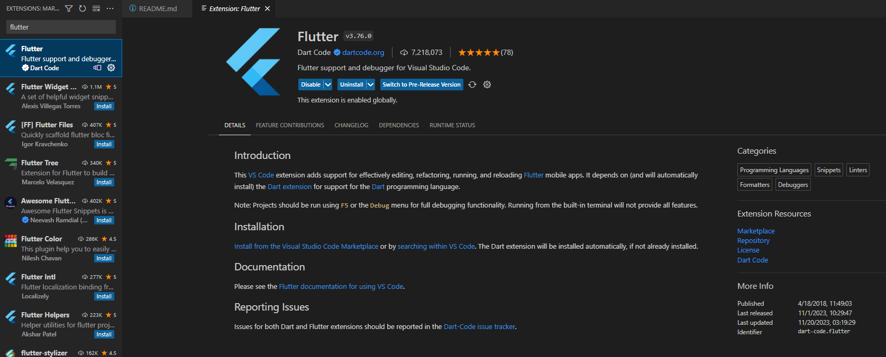

**Paso 7: Dentro de VScode le damos a la pestaña superior ver → abri paleta de comandos y escribimos "flutter: new project" luego seleccionamos "Application" y nos pedirá una carpeta para guardar el proyecto y luego esperamos a que cree el proyecto en la carpeta donde seleccionamos**

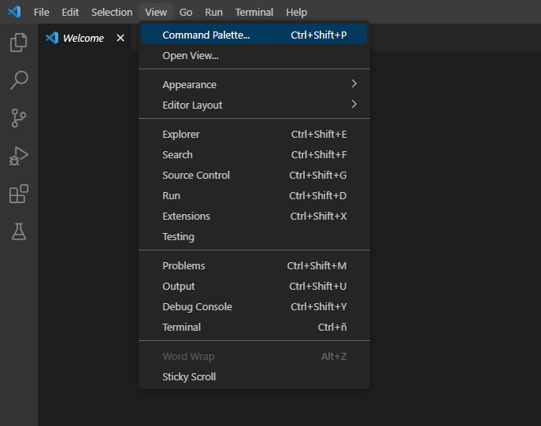
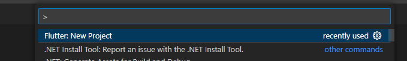
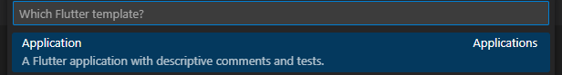
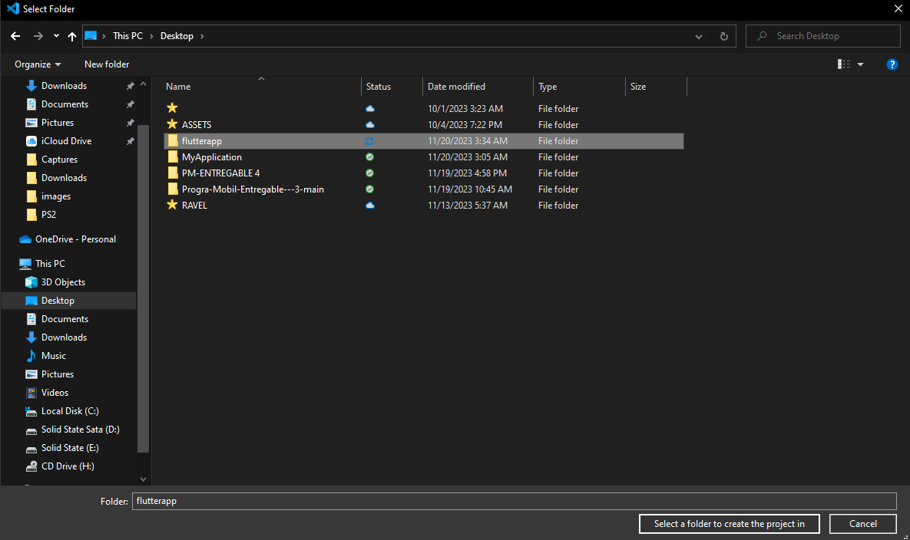
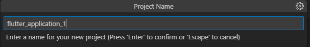
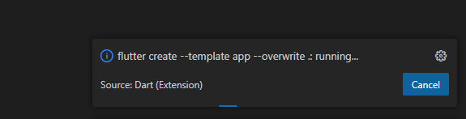

**Paso 8: Finalmente con el proyecto creado presionamos la tecla "F5" y usamos el editor de google Chrome para ver los cambios dentro de nuestro codigo en Flutter y empezar a codear**

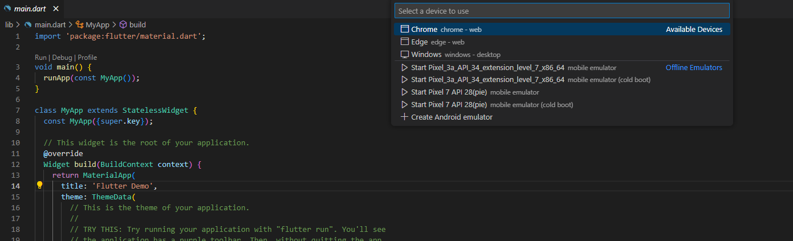
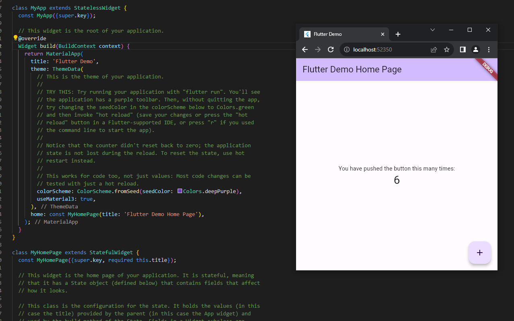


### Fuentes
---
[Guia para instalar Flutter](https://www.digitaldot.es/crear-app-ionic-visual-studio-code/)

[Guia para instalar Node js](https://codigofacilito.com/articulos/instalar-nodejs-windows)

[Guia para instalar VS Code](https://code.visualstudio.com/)

[Guia para instalar Adroid Studio](https://developer.android.com/studio?gclid=Cj0KCQiApOyqBhDlARIsAGfnyMqJ557kYEHhNJFoSlQ2vWjPXoi7R_2eHpgfhfrdTPRC2df-Jcv9CT0aAoMIEALw_wcB&gclsrc=aw.ds)


## Diagrama de despliegue 📦
El diagrama de despliegue muestra la arquitectura de una aplicación móvil desarrollada en Flutter, la cual se ejecuta en un dispositivo Android con sistema operativo Android 11. En el lado del servidor web, se empleará Replit Server, que utiliza Node.js y hace uso de la base de datos SQLite3. Finalmente, la aplicación se conecta al servidor backend de Firebase mediante protocolos HTTP y WebSockets.

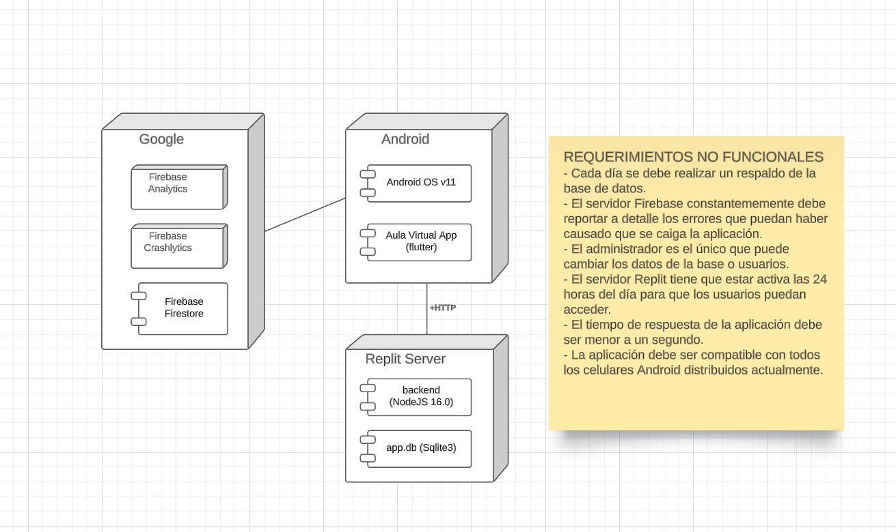


## Requermiemientos no funcionales ⚙️

Los requerimientos están relacionados con el diagrama de despliegue

```
Cada día se debe realizar un respaldo de la base de datos.
- El servidor Firebase constantememente debe reportar a detalle los errores que puedan haber causado que se caiga la aplicación.
- El administrador es el único que puede cambiar los datos de la base o usuarios.
- El servidor Replit tiene que estar activa las 24 horas del día para que los usuarios puedan acceder.
- El tiempo de respuesta de la aplicación debe ser menor a un segundo.
- La aplicación debe ser compatible con todos los celulares Android distribuidos actualmente.
```
## Diagrama de casos de uso 📋

Diagrama elaborado relacionado correctamente a los requisitos funcionales.
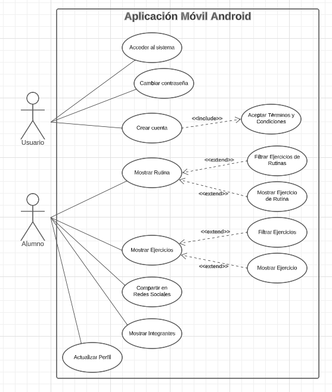


```
REQUERIMIENTOS FUNCIONALES
1. Acceder al Sistema:
El sistema debe permitir a los usuarios iniciar sesión de manera segura.
Se deben autenticar los usuarios mediante credenciales válidas.
2. Cambiar Contraseña:
Los usuarios deben tener la capacidad de cambiar su contraseña de forma segura.
Se deben seguir prácticas de seguridad, como la verificación de la identidad antes de permitir cambios de contraseña.
3. Crear Cuenta:
El sistema debe proporcionar la opción de crear una cuenta nueva.
Durante el proceso de creación de cuenta, se debe incluir la aceptación de términos y condiciones.
4. Mostrar Rutina:
La aplicación debe permitir a los alumnos ver sus rutinas de entrenamiento.
Se debe implementar la capacidad de filtrar ejercicios dentro de las rutinas.
Debe ser posible ver información detallada sobre un ejercicio específico dentro de la rutina.
5. Mostrar Ejercicios:
Los alumnos deben poder acceder a una lista de ejercicios disponibles.
La aplicación debe proporcionar opciones para filtrar los ejercicios según diferentes criterios.
Se debe permitir ver información detallada sobre un ejercicio específico.
6. Compartir en Redes Sociales:
Los alumnos deben tener la opción de compartir su progreso o logros en las redes sociales.
Se deben proporcionar enlaces o integraciones para facilitar el proceso de compartir.
7. Mostrar Integrantes:
La aplicación debe permitir a los alumnos ver información sobre otros miembros del gimnasio.
Se deben incluir funciones para buscar y visualizar perfiles de otros usuarios.
8. Actualizar Perfil:
Los alumnos deben poder actualizar la información de su perfil.
La aplicación debe permitir cambios en la información personal, como la foto de perfil, la información de contacto, etc.
```

### Descripción de casos de uso 
Las descripciones están relacionadas correctamente a los
requisitos funcionales y los mockups


## Construido con 🛠️

_Menciona las herramientas que utilizaste para crear tu proyecto_

* [Flutter](https://docs.flutter.dev/get-started/install/windows) - El SDK usado


## Autores ✒️

_Menciona a todos aquellos que ayudaron a levantar el proyecto desde sus inicios_

* **HECTOR VELARDE** - *Trabajo Inicial* - [HVR22](https://github.com/HVR22)
* **PAOLO ZAPATA** - *Documentación* - [fulanitodetal](#fulanito-de-tal)
* **PATRICK MIÑAN** - *Documentación* - [fulanitodetal](#fulanito-de-tal)

También puedes mirar la lista de todos los [contribuyentes](https://github.com/your/project/contributors) quíenes han participado en este proyecto. 

## Licencia 📄

Este proyecto está bajo la Licencia PMGRUPO2 - mira el archivo [LICENSE.md](LICENSE.md) para detalles